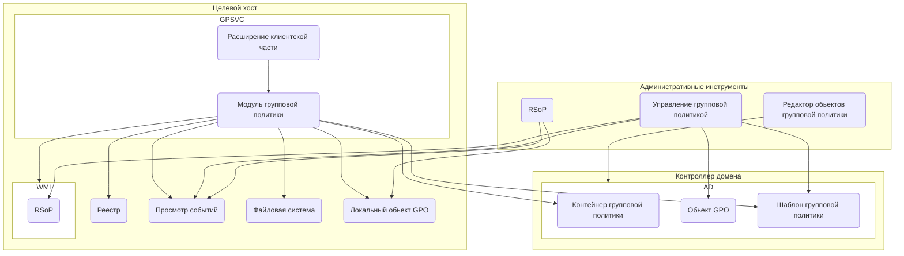

# Групповые политики 

## Оглавление
1. [Архитектра](#introduction)
2. [Диагностика](#paragraph1)
    1. [Sub paragraph](#subparagraph1)

### Архитектра
Сама инфраструктура групповой политики основана на архитектуре «клиент - сервер» с компонентами клиента и сервера и включает в себя модуль групповой политики, представляющий собой основу для обработки общих функциональных параметров административных шаблонов, а также определенных компонентов, называемых расширениями клиентской стороны (Client-side extension, CSE). Расширения клиентской стороны интерпретируют параметры в объекты групповой политики и вносят соответствующие изменения в конфигурацию компьютера или пользователя. 


Архитектура групповой политики

 Можно выделить следующие шесть основных атрибутов, позволяющих описать различные типы данных объекта групповой политики:
displayName. Атрибут, определяющий имя объекта групповой политики;
gPCFileSysPath. Атрибут, указывающий путь к расположению текущего шаблона групповой политики с соответствующим именем GUID;
gPCMachineExtensionNames. Атрибут, определяющий список расширений клиентской стороны конфигурации компьютера, используемых для обработки объекта групповой политики;
gPCUserExtensionNames. Атрибут, определяющий список расширений клиентской стороны конфигурации пользователя, используемых для обработки объекта групповой политики;
значение текущего атрибута выглядит следующим образом: [{35378EAC-683F-11D2-A89A-00C04FBBCFA2}{53D6AB1D-2488-11D1-A28C-00C04FB94F17}], что представляет собой [{GUID CSE-расширения}{GUID расширения MMC}{GUID второго расширения MMC}][GUID-идентификаторы последующих CSE- и MMC-расширений]
versionNumber. В этом атрибуте определен номер версии контейнера GPC объекта групповой политики, который для осуществления синхронизации двух объектов должен быть идентичным с номером версии шаблона групповой политики;
flags. Используя текущий атрибут вы можете просмотреть состояние объекта групповой политики. Под состоянием подразумевается то, что согласно значениям этого атрибута можно определить, включен ли объект GPO (значение 0), отключен ли раздел «Конфигурация пользователя» (значение 1), отключен ли раздел «Конфигурация компьютера» (значение 2) или если объект GPO полностью отключен (значение 3).
Каждый контейнер шаблона групповой политики после настройки объекта GPO создается и сохраняется в папке %SystemRoot%\SYSVOL на каждом контроллере домена. Причем, как уже было сказано ранее, каждый шаблон групповой политики создается с именем, указанным в атрибуте контейнера групповой политики. Шаблон групповой политики включает в себя практически все параметры объекта групповой политики, которые были добавлены в сам объект GPO. В основном, эти параметры можно найти в следующих папках:
Adm. Ввиду того, что начиная с операционных системы Windows Vista и Windows Server 2008 для административных шаблонов стали использоваться ADMX и ADML файлы, необходимость в этой папке отпала. В случае использования устаревших административных шаблонов, все файлы административных шаблонов *.adm из папки %SystemRoot%\inf того компьютера, на котором создавался объект GPO, будут сохраняться в текущей папке;
USER. В этой папке вы можете найти все внесенные в объект групповой политики изменения для конфигурации пользователя. В зависимости от того, как вы настроите объект GPO, в текущей папке можно найти следующее:
Registry.pol – параметры системного реестра, настроенных параметров политики административных шаблонов;
\Applications – информацию по установке программного обеспечения при помощи CSE GGPSI;
\Documents & Settings – данные о перенаправлении папок;
\Microsoft\IEAK – информацию о настройках браузера Internet Explorer;
\Scripts\Logon – файлы сценариев входа, настроенных в GPO;
Scripts\Logoff – файлы сценариев выхода, настроенных в GPO;
MACHINE. В этой папке вы можете найти все внесенные в объект групповой политики изменения для конфигурации компьютера. В зависимости от того, как вы настроите объект GPO, в текущей папке можно найти следующее:
Registry.pol – параметры системного реестра, настроенных параметров политики административных шаблонов;
\Applications – информацию по установке программного обеспечения при помощи CSE GGPSI;
\Microsoft\Windows NT\SecEdit – файл GptTmpl.inf, определяющий настройки, указанные в узле «Параметры безопасности»;
Scripts\Shutdown – файлы сценариев завершения работы, настроенных в GPO;
Scripts\Startup – файлы сценариев запуска компьютера, настроенных в GPO;
Gpt.ini. Файл, используемый для выводимого имени соответствующего объекта групповой политики и хранения номера версии шаблона GPO.


Как вы видите на этой иллюстрации, в обработке групповой политики принимают участие библиотеки, отвечающие за следующие расширения клиентской стороны:
Appmgmts.dll. Библиотека, предназначенная для обработки политики установки программного обеспечения;
Auditsce.dll. Библиотека, используемая для настройки политики аудита;
Cscobj.dll. Библиотека, сопоставленная с расширением клиентской стороны файлов Microsoft Office;
Dot3gpclnt.dll. Библиотека, обрабатывающая политики проводной сети IEEE 802.3;
Dskquota.dll. Библиотека, выполняющая обработку дисковой квоты;
Fdeploy.dll. Библиотека, используемая для перенаправления папок;
Gpprefcl.dll. Библиотека, выполняющая обработку окружения групповой политики, включающая большинство расширений клиентской стороны;
Gpprnext.dll. Библиотека, при помощи которой назначаются политики развертывания принтеров;
Gpscript.dll. Библиотека, отвечающая за расширение клиентской стороны, управляемой работой с сценариями;
Gptext.dll. Библиотека, использующаяся для обработки QoS на основе политики, TCP IP и некоторых сценариев;
Iedkcs32.dll. Библиотека, позволяющая управлять параметрами политики настройки браузера Internet Explorer;
Polstore.dll. Библиотека, предназначенная для работы с политиками IP-безопасности;
Scecli.dll. Применяется при обработке параметров безопасности;
TsUsbRedirectionGroupPolicyExtension.dll. Библиотека, предназначенная для перенаправления USB устройств;
Userenv.dll. Библиотека, включающая в себя модуль групповой политики и административные шаблоны;
Wlgpclnt.dll. Библиотека, обрабатывающая политики беспроводной сети IEEE 802.11.

Для того чтобы определить параметры групповой политики, распространяемые на целевого пользователя или компьютер, результирующая политика во время своей работы использует инструментарий управления Windows (WMI). Поставщик WMI позволяет создавать отчеты по заданным в мастере результирующей политики параметрам, а также определяет, когда именно выполнялась обработка объекта групповой политики, какие параметры были применены, какие ошибки возникли в процессе применение и так далее. Для выполнения сбора информации, как на контроллере домена, так и на клиентском компьютере должна быть запущена служба «Инструментарий управления Windows» (Winmgmt.exe), при помощи которой информация иерархии WMI моделируется как иерархия стандартов объектов общей модели данных (Common Information Model, CIM). Такая иерархия является расширением, позволяющим разным службам и приложениям предоставлять поставщику WMI информацию о конфигурации. Вся информация, которая собирается поставщиком, сохраняется в базе данных WMI на локальном компьютере, также известном, как база данных CIMOM. Так как сгенерированные поставщиком WMI данные могут быть динамическими и статическими, а, в свою очередь, статические данные хранятся в базе CIMOM для того, чтобы они могли быть извлечены в любое время, при выполнении запросов результирующей политики генерируются статические данные WMI. При помощи запросов результирующей групповой политики в базу данных WMI на контроллере домена сохраняется информация о политиках целевого компьютера, после чего вся эта информация отображается в оснастке «Управление групповой политикой». Также при обработке результирующей политики стоит обратить внимание на работу поставщика результирующего набора политики. Работу поставщика результирующего набора групповой политики можно проанализировать на примере режима планирования результирующей политики. В этом режиме, для генерации отчета результирующей политики даже не нужно присутствие в сети самого клиентского компьютера, так как информация рассчитывается на основании существующих объектов групповой политики, которые будут применяться к текущему объекту. В этом случае, на контроллере домена, поставщик результирующего набора политики выполняет определенные функции клиентской операционной системы, требуемые для применения объектов GPO. Данный поставщик при обработке режима планирования результирующей групповой политики использует три следующих параметра:
Область управления (Scope of management, SOM), которая является сочетанием объектов пользователя и компьютера;
WMI фильтр, который может применяться к целевому объекту во время генерирования отчета результирующей политики;
Членство в группах безопасности объектов компьютеров и пользователей, определяющее реальные группы безопасности, членами которых являются целевой пользователь или компьютер.
Помимо всего указанного выше, следует также обратить внимание на то, что для успешного генерирования отчета результирующей групповой политики, должны быть соблюдены следующие обязательные условия:
На целевом компьютере должна быть установлена операционная система не ниже Windows XP;
У учетной записи, которая генерирует отчет RSoP на конечном компьютере, должны быть привилегии администратора;
На обоих компьютерах должна быть запущена служба «Инструментарий управления Windows»;
Для того чтобы иметь доступ к WMI, на конечном компьютере должны быть открыты порты 135 и 445;
В том случае, если генерируется отчет RSoP для определенного пользователя, этот пользователь должен как минимум один раз выполнить вход в домен под своей учетной записью.
Принципы работы результирующей политики в режиме журналирования и планирования отображены на следующей иллюстрации:

Исходя из предоставленной выше иллюстрации, режим журналирования результирующей групповой политики работает следующим образом:
Во время выполнения пользователем входа в домен, процесс Gpsvc при использовании контекста безопасности пользователя или компьютера получает список объектов групповой политики из домена Active Directory, которые распространяются на этот объект;
Процесс Gpsvc последовательно сохраняет в базу данных WMI экземпляры расширений клиентской стороны объектов групповой политики;
Список зарегистрированных расширений групповой политики извлекается из базы данных и на конечный компьютер выводится подробный отчет в динамическом формате HTML, после чего в самой консоли отображается динамическое содержимое отчета результирующей групповой политики.
В свою очередь, при выполнении результирующей групповой политики в режиме планирования, поставщик результирующего набора политики выполняет следующие действия:
При помощи мастера утилита результирующей групповой политики, RSoP моделирует применение политики с помощью службы групповой политики доступа к каталогу (GPDAS) и извлекает из контроллера домена имя пользователя или компьютера и подключается к базе данных WMI;
Служба WMI на том же компьютере, на котором генерируется отчет результирующей политики вызывает поставщика WMI, а затем получает список объектов групповой политики, которые распространяются на определенного пользователя или компьютер в Active Directory;
База данных WMI заполняется экземплярами объектов групповой политики для определенного пользователя или компьютера;
После чего извлекается список зарегистрированных расширений клиентской стороны, где каждое расширение загружается последовательно. После того как данные были занесены в базу данных, поставщик результирующего набора групповой политики возвращает список имен и передает их инструменту результирующей политики;
Результирующая политика подключается к пространству имен базы данных WMI на контроллере домена и при помощи API интерфейса WMI получает данные о групповой политике. На конечный компьютер выводится подробный отчет в динамическом формате HTML, после чего в самой консоли отображается динамическое содержимое отчета результирующей групповой политики.

Как вы уже поняли из всего вышеизложенного, каждая группа параметров групповой политики обслуживается определенным расширением клиентской стороны (Client-side Extension, CSE), установленном и зарегистрированном в процессе установки операционной системы Windows. По сути, расширений клиентской стороны можно разделить на логические категории, соответствующие определенным узлам, расположенным в дереве консоли оснастки «Редактор управления групповой политикой». Сами расширения CSE состоят из динамически подключаемых библиотек, вызываемых при помощи модуля групповой политики, который для определения параметров групповой политики, применяемых к целевому компьютеру или пользователю, использует информацию шаблона групповой политики из контейнера групповой политики. Соответственно, расширения клиентской стороны применяются на целевой компьютер только в том случае, если изменены соответствующие параметры групповой политики. Физически, все библиотеки DLL, отвечающие за расширения клиентской стороны можно найти в папке %windir%\System32, однако, если какое-то определенное расширение CSE было написано сторонним производителем, оно может храниться в расположении отличном от расположения CSE по умолчанию. Несмотря на то, что большинство параметров групповой политики применяются так, чтобы ни пользователь, ни администратор клиентского компьютера не могли изменить соответствующий системный параметр при помощи графического интерфейса, некоторые параметры, управляемые расширениями CSE все-таки можно изменить. Стоит обратить внимание на то, что все библиотеки DLL для каждого расширения клиентской стороны регистрируются в операционной системе и просмотреть список расширений CSE можно при помощи редактора системного реестра в разделе HKEY_LOCAL_MACHINE\Software\Microsoft\Windows NT\CurrentVersion\Winlogon\GPExtensions.
Как вы уже, наверное, догадались, судя по информации из раздела, посвященного контейнеру групповой политики, к каждому расширению клиентской стороны привязывается идентификатор GUID, включающий в себя набор определенных атрибутов, позволяющих указать разные параметры конфигурации обработки групповой политики. В контейнере GPC вы могли увидеть эти идентификаторы в атрибутах gPCMachineExtensionNames и gPCUserExtensionNames. Находясь в разделе идентификатора GUID определенного расширения CSE, вы можете с легкостью узнать имя библиотеки DLL, отвечающей за текущее расширение клиентской стороны, посмотрев на значение параметра Dllname. Все расширения клиентской стороны, созданные при установке операционной системы, связаны с идентификаторами GUID, предоставленными в следующей таблице:
Расширение клиентской стороны	DLL	Идентификатор GUID
Групповые политики беспроводной сети	gptext.dll	{0ACDD40C-75AC-47ab-BAA0-BF6DE7E7FE63}
Групповые политики среды	gpprefcl.dll	{0E28E245-9368-4853-AD84-6DA3BA35BB75}
Групповые политики локальных пользователей и групп	gpprefcl.dll	{17D89FEC-5C44-4972-B12D-241CAEF74509}
Групповые политики настроек устройств	gpprefcl.dll	{1A6364EB-776B-4120-ADE1-B63A406A76B5}
Перенаправление папок	fdeploy.dll	{25537BA6-77A8-11D2-9B6C-0000F8080861}
Реестр	userenv.dll	{35378EAC-683F-11D2-A89A-00C04FBBCFA2}
Квота дисков Microsoft	dskquota.dll	{3610eda5-77ef-11d2-8dc5-00c04fa31a66}
Групповые политики сетевых настроек	gpprefcl.dll	{3A0DBA37-F8B2-4356-83DE-3E90BD5C261F}
QoS на основе политики	gptext.dll	{426031c0-0b47-4852-b0ca-ac3d37bfcb39}
Сценарии	gptext.dll	{42B5FAAE-6536-11d2-AE5A-0000F87571E3}
Групповые политики зон безопасности Internet Explorer	iedkcs32.dll	{4CFB60C1-FAA6-47f1-89AA-0B18730C9FD3}
Групповые политики сопоставления дисков	gpprefcl.dll	{5794DAFD-BE60-433f-88A2-1A31939AC01F}
Групповые политики папок	gpprefcl.dll	{6232C319-91AC-4931-9385-E70C2B099F0E}
Групповые политики общих сетевых ресурсов	gpprefcl.dll	{6A4C88C6-C502-4f74-8F60-2CB23EDC24E2}
Групповые политики файлов	gpprefcl.dll	{7150F9BF-48AD-4da4-A49C-29EF4A8369BA}
Групповые политики источников данных	gpprefcl.dll	{728EE579-943C-4519-9EF7-AB56765798ED}
Групповые политики INI-файлов	gpprefcl.dll	{74EE6C03-5363-4554-B161-627540339CAB}
Групповые политики поиска Windows / WDS	srchadmin.dll	{7933F41E-56F8-41d6-A31C-4148A711EE93}
Безопасность	scecli.dll	{827D319E-6EAC-11D2-A4EA-00C04F79F83A}
Групповые политики развертывания принтеров	gpprnext.dll	{8A28E2C5-8D06-49A4-A08C-632DAA493E17}
Групповые политики служб	gpprefcl.dll	{91FBB303-0CD5-4055-BF42-E512A681B325}
Internet Explorer Branding / Internet Explorer	iedkcs32.dll	{A2E30F80-D7DE-11d2-BBDE-00C04F86AE3B}
Групповые политики настроек папок	gpprefcl.dll	{A3F3E39B-5D83-4940-B954-28315B82F0A8}
Групповые политики назначенных заданий	gpprefcl.dll	{AADCED64-746C-4633-A97C-D61349046527}
Групповые политики реестра Windows	gpprefcl.dll	{B087BE9D-ED37-454f-AF9C-04291E351182}
Восстановление EFS	scecli.dll	{B1BE8D72-6EAC-11D2-A4EA-00C04F79F83A}
Групповые политики проводной сети 802.3	dot3gpclnt.dll	{B587E2B1-4D59-4e7e-AED9-22B9DF11D053}
Групповые политики принтеров	gpprefcl.dll	{BC75B1ED-5833-4858-9BB8-CBF0B166DF9D}
Групповые политики ярлыков	gpprefcl.dll	{C418DD9D-0D14-4efb-8FBF-CFE535C8FAC7}
Групповые политики файлов Microsoft Offline	cscobj.dll	{C631DF4C-088F-4156-B058-4375F0853CD8}
Установка программ	appmgmts.dll	{c6dc5466-785a-11d2-84d0-00c04fb169f7}
IP безопасность	polstore.dll	{e437bc1c-aa7d-11d2-a382-00c04f991e27}
Групповые политики настроек Интернета	gpprefcl.dll	{E47248BA-94CC-49c4-BBB5-9EB7F05183D0}
Групповые политики параметров меню «Пуск»	gpprefcl.dll	{E4F48E54-F38D-4884-BFB9-D4D2E5729C18}
Групповые политики региональных настроек	gpprefcl.dll	{E5094040-C46C-4115-B030-04FB2E545B00}
Групповые политики настройки электропитания	gpprefcl.dll	{E62688F0-25FD-4c90-BFF5-F508B9D2E31F}
Групповые политики приложений	gpprefcl.dll	{F9C77450-3A41-477E-9310-9ACD617BD9E3}
Корпоративная политика QoS	gptext.dll	{FB2CA36D-0B40-4307-821B-A13B252DE56C}
Расширение клиентской стороны «Установка программ»

Архитектура компонентов расширения клиентской стороны установки программ выглядит следующим образом. Системный администратор создает пакет установщика Windows для приложения, которое следует распространить на пользователей или их компьютеры. Далее ему предстоит создать точку распространения программного обеспечения (Software Distribution Point, SDP), представляющую собой общую папку, из которой позже пользователи и компьютеры будут устанавливать соответствующее программное обеспечение. Желательно, чтобы на этапе планирования точек SDP для каждого приложения была создана своя собственная папка. Для таких папок должно быть установлено NTFS разрешение на чтение и выполнение, так как в противном случае у пользователей не удастся установить приложения. После этого, администратор, на своей рабочей машине, используя оснастки «Управления групповой политикой» и «Редактор управления групповой политикой» создает объект групповой политики, предназначенный для распространения пакета приложения на пользователей или компьютеры, и связывает данный объект GPO с конкретным подразделением.
При помощи расширения CSE «Установка программ» вы можете распространять программное обеспечение на ваших клиентов двумя способами, а именно путем публикации приложения только для пользователей, или при помощи назначения приложения пользователям и компьютерам, разница между которыми вкратце описана ниже:
Публикация приложения. Прежде всего, необходимо помнить о том, что приложение может быть опубликовано только для пользователя. После того как вы опубликуете программное обеспечение, его ярлык не будет отображаться на рабочем столе или в меню «Пуск», однако, это приложение можно найти и установить в компоненте панели управления «Программы и компоненты». Помимо этого, опубликованное приложение может быть установлено при попытке открытия файла, ассоциированного с текущим приложением. После развертывания объекта групповой политики, опубликованное программное обеспечение можно будет установить при следующем входе пользователя в систему и пользователь, для которого будет установлено ПО может, при необходимости, его удалить при помощи «Программы и компоненты». Для публикации приложений поддерживаются файлы *.msi и *.zap;
Назначение приложения. В отличие от публикации приложения, назначать приложение можно как пользователям, так и компьютерам. Также, после назначения приложения, у пользователя обновляются некоторые локальные параметры реестра, благодаря чему он сможет найти ярлыки для назначенных приложений в меню «Пуск» и на рабочем столе, причем, ярлык на рабочем столе будет отображен, независимо от того, с какого компьютера выполнялся вход в систему. При назначении программы пользователю, программное обеспечение будет установлено при следующем входе в систему или при открытии файла, ассоциированного с текущим приложением, а при назначении приложения компьютеру, установка программного обеспечения начнется во время следующей загрузки компьютера. В том случае, если пользователю нужно будет удалить назначенное приложение, он сможет это сделать только в том случае, если приложение было назначено для пользователя, причем, после его удаления, программу снова можно будет найти на рабочем столе или в меню «Пуск». Для назначения приложений используются файлы *.msi.


Процесс публикации программного обеспечения
Расширение клиентской стороны установки программ извлекает всю информацию о пакете, включая имя приложения, путь для установки, сведения об ассоциации файлов, идентификаторы класса и прочее, изменяет его и сохраняет в своей папке, продублировав в папке Sysvol на контроллере домена. Как уже отмечалось ранее, для публикации приложений можно использовать как MSI-инсталляторы, так и *.zap-файлы, причем, оба пакета установки обрабатываются по-разному. Например, файл пакета установки программного обеспечения содержит базу данных со всеми необходимыми инструкциями по установке или удалению приложения, а за установку программы на клиентском компьютере отвечает служба «Установщик Windows», использующая для чтения файлов *.msi библиотеку Msi.dll. Соответственно, на основании объявленной в инсталляционном пакете информации, данная служба копирует файлы программы на жесткий диск, а также вносит изменения в реестр и выполняет прочие задачи, указанные в инсталляторе. Чаще всего, вся информация, указанная в инсталляционном msi-файле задается разработчиком устанавливаемого программного продукта. Так как не все производители программного обеспечения используют инсталляционные файлы установщика Windows, в некоторых случаях может понадобиться создавать *.zap-файлы, являющиеся текстовыми файлами с необходимыми инструкциями по установке приложения. После создания такого файла его необходимо поместить в папку с инсталляционным пакетом, чтобы расширение CSE смогло выполнить инструкции по установке, после публикации которого, приложение появится в компоненте панели управления «Программы и компоненты» и пользователи смогут его установить. Но, в отличие от MSI-инсталлятора, у zap-файлов есть такие существенные ограничения, как, например, то, что у вас не получится настроить процесс установки приложения, если инсталлятор не содержит параметров установки.
Информация, которая объявляется в пакете инсталлятора, необходима для того, чтобы в домене Active Directory создался объект пакета публикации в контейнере ClassStore. В самом объекте групповой политики, пакет размещается в подконтейнере GUID\User\Class Store\Packages, где инсталляционному пакету назначается новый GUID и каноническое имя CN. После этого расширение CSE установки программ в папке Sysvol создает специальный сценарий для объявления приложения с именем объекта публикуемого приложения PackageRegistration и расширением *.aas, который размещается в GUID\User\Applications объекта GPO. Так как в публикуемых приложениях нет ярлыков на рабочем столе и в меню «Пуск», эта информация исключается из текущего файла. В связи с тем, что при обработке групповой политики опубликованные приложения на клиентском компьютере не вызывают каких-либо изменений, а конечному пользователю нужно будет установить соответствующее приложение из компонента «Программы и компоненты», из Sysvol и Active Directory не загружается никакая информация. Другой процесс установки опубликованного приложения считается более сложным. В случае, когда пользователь открывает файл с расширением, которое ассоциируется с опубликованным приложением, в этот момент расширение клиентской стороны GPSI ищет в Active Directory объект PackageRegistration, который ассоциируется с текущим расширением или проверяется CLSID, сгенерированным при помощи обработанного объекта групповой политики для пользователя. Если находится хотя бы один *.aas-файл, то такой сценарий загружается на клиентский компьютер и выполняется для последующей установки. На следующей иллюстрации отображен процесс публикации приложения:

Процесс назначения программного обеспечения
Как вы знаете, основным отличием данного метода развертывания приложений средствами GPO от публикации является то, что при назначении приложение полностью устанавливается в том случае, если приложение назначается для компьютера, а в случае назначения для пользователя, пользователю будут доступны ярлыки на рабочем столе и в меню «Пуск». Причем, обязательно стоит обратить внимание на то, что установка назначенного программного обеспечения обрабатывается модулем групповой политики только во время загрузки компьютера или при входе пользователя в систему. Принцип создания назначенного инсталляционного пакета практически ничем не отличается от создания опубликованного пакета за исключением того, что в объекте PackageRegistration свойство атрибута PackageFlags указывается как Assigned (назначение), а не Publication (публикация). Во время обработки объекта групповой политики расширение клиентской стороны «Установка программ» в Active Directory запрашивает в объекте PackageRegistration папку с размещенным назначенным инсталлятором и определяет, какие инсталляторы были изменены или добавлены после предыдущей обработки групповой политики. Все пакеты, которые обнаруживает CSE, сравниваются с загруженными локально на клиентский компьютер. После чего новые пакеты регистрируются в системном реестре, из папки Sysvol вычитываются файлы *.aas, а затем кэшируются в папке %systemroot%\appmgmt и обрабатываются только новые или измененные инсталляционные пакеты. На следующей иллюстрации вы можете увидеть процесс установки назначенных приложений:


рхитектура параметров безопасности

Прежде всего, следует рассмотреть компоненты операционной системы Windows, которые имеют отношение к параметрам безопасности и взаимодействуют с инструментами, предназначенными для управления групповыми политиками. По сути, таких компонентов не так уж и много. Одним из основных компонентов является библиотека Scesrv.dll, которая располагается в процессе Servicecs.exe, выполняемого в контексте локальной системы и предназначена для обеспечения функциональности механизма безопасности. К таким функциям можно отнести настройку, распространение, импорт, а также анализ. Сам процесс анализа параметров безопасности, распространяемых на пользователей или компьютеры, выполняется путем вызова интерфейса программирования приложений API совместно с системным реестром, LSA и SAM. Если рассматривать контроллеры домена, то на них библиотека Scesrv.dll получает уведомления об изменениях, которые должны распространяться между контроллерами домена, указанных SAM и LSA.
Так как библиотека Scesrv.dll отвечает за ядро механизма обеспечения функциональности параметров безопасности, распространяемых средствами групповой политики, за интерфейс всего этого механизма должна отвечать еще какая-то библиотека. Библиотека Scecli.dll предоставляет механизму параметров безопасности пользовательский интерфейс, а также принимает участие в генерировании отчетов результирующей групповой политики. Для загрузки применяемых файлов групповой политики с параметрами безопасности, распространяемыми на клиентские компьютеры из папки Sysvol, библиотека Scrsrv.dll использует библиотеку Scecli.dll. В свою очередь, для отображения пользовательского интерфейса в оснастках MMC, данная библиотека загружается в Wsecedit.dll для установки параметров безопасности, установленных по умолчанию, включая настройки безопасности системного реестра, служб, настроек *.INF-файлов и многого другого. Помимо этого, для реализации настроек параметров безопасности и последующего анализа, утилита командной строки Secedit.dll также во время своей работы использует библиотеку Scrcli.dll.
Кроме этих двух библиотек, принимающих ключевую роль в расширении клиентской стороны параметров безопасности также можно выделить такие компоненты, как:
Библиотеку Wsecedit.dll, которая представляет собой расширение оснастки редактора управления групповой политикой «Параметры безопасности» и используется для настройки параметров безопасности в самом объекте групповой политики;
Пользовательские базы данных, представляющие собой любой тип баз данных, отличных от системных баз данных, созданных системным администратором для настройки и анализа параметров безопасности;
Secedit.sdb. Файл, который находится в папке %%Windir\Security\database, представляющий собой постоянную базу данных, применяемую для распространения политики;
Шаблоны *.INF, которые представляют собой текстовые файлы, содержащие декларативные параметры безопасности, загружаемые в базу данных и хранящиеся в INF-файлах в папке Sysvol на контроллерах домена.
Схема компонентов параметров безопасности выглядит следующим образом:

Процесс распространения параметров безопасности

Принцип распространения объектов групповых политик с параметрами безопасности на пользователей и компьютеры ничем не отличается от распространения объектов GPO с административными шаблонами. Другими словами, во время загрузки операционной системы сначала запускается сеть, а вместе с сетью запускаются служба удаленного вызова процедур (RPCSS) и поставщик множественных UNC (MUP). После этого компьютер получает список объектов групповой политики, которые должны применяться к учетной записи компьютера, в зависимости от того, входит ли пользователь в домен Active Directory, а также от расположения учетной записи компьютера в домене. Далее применяются параметры групповой политики, настраиваемые в узле «Конфигурация компьютера» оснастки «Редактор управления групповой политики». Следующими обрабатываются сценарии запуска, причем, каждый сценарий выполняется последовательно. После выполнения сценариев запуска пользователь видит на экране текст с предложением воспользоваться комбинацией Ctrl+Alt+Delete для выполнения входа в систему. Затем, после успешной проверки подлинности, загружается пользовательский профиль, во время чего применяются параметры групповой политики, связанные с учетной записью пользователя. В этот момент применяются политики пользователя, сценарии входа в систему. И уже после того, как все параметры групповой политики будут применены к компьютеру и пользователю, для пользователя станет доступен дружественный интерфейс операционной системы. На протяжении всего этого процесса, параметры безопасности, указанные в объектах групповой политики распространяются следующим образом:

Рассмотрим процесс, отображенный на иллюстрации более подробно:
Во время обработки объектов групповой политики, механизм групповой политики определяет применяемые параметры безопасности;
В том случае, если в объекте групповой политики присутствуют настроенные параметры безопасности, групповая политика вызывает б иблиотеку Scecli.dll с расширением клиентской стороны параметров безопасности;
Расширение CSE параметров безопасности вместе с динамической библиотекой Scecli.dll загружает политику из определенного расположения в домене Active Directory;
В соответствии с приоритетами объектов групповой политики, расширение клиентской стороны параметров безопасности объединяет все параметры политики и обрабатывает их в известном вам порядке: локальные объекты групповой политики, объекты групповой политики, назначенные на уровне сайта, затем на уровне домена и, в конце-концов, на уровне подразделения. Если с подразделением, в которое входит пользователь или компьютер распространяются несколько объектов групповой политики с настроенными параметрами безопасности и настройки параметров безопасности одного объекта не противоречат настройкам остальных, в таком случае все параметры политики считаются накопительными и объединяются при обработке. Если же настройки параметров безопасности одного объекта групповой политики противоречат настройкам другого, то к пользователю или к компьютеру будут применяться те настройки, объект групповой политики которых обладает наивысшим приоритетом. Например, в объекте GPO 1 установлена минимальная длина пароля 8 символов, а в объекте GPO 2, значением того же параметра является 12 символов и объект GPO 2 обладает высшим приоритетом для подразделения, в которое входит учетная запись компьютера, на котором пользователь выполняет вход, то минимальная длина пароля пользователя будет составлять 12 символов;
Результат настроек параметров безопасности динамическая библиотека обеспечения основной функциональности механизма безопасности Scesrv.dll сохраняет в базе данных secedit.sdb;
После всего указанного выше, библиотека Scesrv,dll применяет параметры безопасности к компьютерам.


*********

Репликация групповых политик

если редактирование GPO ведется с помощью Group Policy Management Editor (GPME), тогда по умолчанию используется контроллер домена, выполняющий роль эмулятора PDC
Шаблон групповой политики (GPT) – это часть групповой политики, настройки которой хранятся в одном или нескольких файлах
c:\Windows\Sysvol\Sysvol\<domainname>\Policies
Sysvol реплицируется с использованием службы репликации файлов File Replication System (FRS). Служба FRS не использует репликацию по графику, вместо этого она использует механизм репликации по состоянию
Контейнеры групповых политик (Group Policy Container -GPC) хранятся в Active Directory.
содержит всю ссылочную информацию для GPO, а именно путь к GPT, в том числе GUID объекта групповой политики, а также всю информацию о GPC в Active Directory.
Для контроллеров домена в одном сайте репликация происходит каждые 15 секунд. Этот интервал не может быть изменен и контролируется механизмом проверки согласованности (Knowledge Consistency Checker — KCC).
Второй тип репликации по умолчанию происходит каждые 3 часа, и контролируется службой межсайтовой топологии — Intersite Topology Generator (ISTG)
{#ch1}
****************

Команда GPResult: диагностика результирующих групповых политик

Результаты выполнения команды разделены на 2 секции:
•	COMPUTER SETTINGS (Конфигурация компьютера) – раздел содержит информацию об объектах GPO, действующих на компьютер в Active Directory;
•	USER SETTINGS – раздел с политиками пользователя (политики, действующие на учетную запись пользователя в AD).
Вкратце пробежимся по основным параметрам/разделам, которые нас могут заинтересовать в выводе GPResult:
•	Site Name (Имя сайта:)– имя сайта AD, в котором находится компьютер;
•	CN – полное каноническое пользователя/ компьютера, для которого были сгенерированы данные RSoP;
•	Last time Group Policy was applied (Последнее применение групповой политики)– время, когда последний раз применялись (обновились) настройки GPO;
•	Group Policy was applied from (Групповая политика была применена с)– контроллер домена, с которого была загружена последняя версия GPO;
•	Domain Name и Domain Type (Имя домена, тип домена)– имя и версия схемы домена Active Directory;
•	Applied Group Policy Objects (Примененные объекты групповой политики) – списки действующих объектов групповых политик;
•	The following GPOs were not applied because they were filtered out (Следующие политики GPO не были применены, так как они отфильтрованы)— не примененные (отфильтрованные) GPO;
•	The user/computer is a part of the following security groups (Пользователь/компьютер является членом следующих групп безопасности) – список доменных групп безопасности, в которых состоит пользователь/пользователь.
GPResult /s wks22123 /r /user a.ivanov
GPResult /h c:\gp-report\report.html /f

•	Filtering: Not Applied (Empty) (Фильтрация: Не применено (пусто)) – политика пустая (применять, нечего);
•	Filtering: Denied (Unknown Reason) (Фильтрация: Не применено (причина неизвестна)) – скорее всего у пользователя или компьютера отсутствуют разрешения на чтение/применение этой политики. Разрешения настраиваются на вкладке Security в консоли управления доменными GPO — GPMC (Group Policy Management Console);
•	Filtering: Denied (Security) (Фильтрация: Отказано (безопасность)) — в секции Apply Group Policy указан явный запрет в разрешении Apply group policy либо объект AD не входит в список групп в разделе настроек Security Filtering

****************

Почему не применяется групповая политика к компьютеру/пользователю или OU

Если вы настраиваете параметр в секции Конфигурация компьютера (Computer Configuration), значит ваша групповая политика должна быть привязана к OU с компьютерами. Соответственно, если настраиваемый параметр относится к Конфигурация пользователя (User configuration), значит нужно назначить политику на OU с пользователями
Проверьте значение фильтра безопасности политики (Security Filtering). По-умолчанию на всех новых объектах GPO в домене присутствуют разрешения для группы»Authenticated Users«. Эта группа включает в себя всех пользователей и компьютеры домена. Это означает, что данная политика будет применяться для всех пользователей и компьютеров, которые попадают в область ее действия
В групповых политиках можно использовать специальные WMI фильтры. Это позволяет применить политику к компьютерам на основании некоторого WMI запроса. Например, мы можете создать WMI фильтр GPO для применения политики только к компьютерам с определенной версией Windows, к устройствам в определенной IP подсети, только к ноутбукам и т.д.
Проверьте статус групповой политики, перейдя в консоли GPMC.msc в свойствах политики на вкладку Details. Обратите внимание на значение в поле GPO Status.
•	All setting disabled – все настройки политики отключены (не применяются);
•	Computer configuration settings disabled – не применяются настройки из параметров GPO компьютера;
•	User configuration settings disabled – не применятся настройки пользовательских политик;
•	Enabled – все настройки политики применяются к целевым объектам AD (значение по –умолчанию).
На вкладке политики Delegation указаны разрешения, настроенные для данной групповой политики. Здесь можно увидеть каким группам даны права на изменения настроек GPO, а также на разрешение или запрет применения политики
Наследование — это одна из основных концепций групповых политик. Политики верхнего уровня по-умолчанию применяются ко всем вложенным объектам в иерархии домена. Администратор может заблокировать применение всех наследованных политик на определенный OU. Для этого в консоли GPMC нужно щелкнуть правой кнопкой по OU и выбрать пункт меню Block inheritance
1.	Локальные политики компьютера (Local), настроенные через консоль редактора локальных GPO gpedit.msc (при некорректной настройке их можно сбросить);
2.	Групповые политики уровня сайта (Site);
3.	Групповые политики уровня домена (Domain);
4.	Групповые политики уровня организационного подразделения (Organizational Unit).
У каждого объекта GPO, который привязан к организационному контейнеру AD вы можете включить или отключить связь (применение политики). Для этого нужно включить или отключить опцию Связь включена (Link Enabled) в меню политики
При включении опции Режим замыкания групповой политики (Loopback Processing mode) вы можете применить к компьютеру настройки, которые содержаться в секции GPO с настройками пользователями. Т.е. режим замыкания GPO позволяет применить политики пользователя в зависимости от компьютера, на который он логинится.
Также нужно помнить, как обновляются групповые политики в Windows. По-умолчанию GPO обновляются в фоновом режиме в интервале от 90 до 120 минут.
GroupPolicy (Microsoft-Windows-GroupPolicy)

******************

Способы обновления групповых политик Windows

•	Открыт порт TCP 135 в Windows Firewall;
•	Включены службы Windows Management Instrumentation и Task Scheduler.

******************
Отладочный журнал обработки GPO на клиентах
``` powershell
REG ADD "HKLM\SOFTWARE\Microsoft\Windows NT\CurrentVersion\Diagnostics" /v GPSvcDebugLevel /t REG_DWORD /d 0x00030002 /f
```
``` powershell
cat %Systemroot%\Debug\UserMode\Userenv.log
```
******************
Методика диагностики причин долгого применения GPO

События 4016 и 5016 показывают время начала и завышения процесса обработки расширений применения GPO, причем в последнем указано общую длительность обработки расширения.К примеру, на скриншоте ниже был включен фильтр журнала Group Policy -> Operational по событиям 4016 и 5016. По тексту события 5016 можно увидеть время обработки этого компонента GPO
•	Событие 5312 содержит список применённых политик, а в событии 5317 есть список отфильтрованных GPO.
•	В событиях 8000 и 8001 содержится, соответственно, время обработки политик компьютера и пользователя при загрузке компьютера. А в событиях 8006 и 8007 есть данные о времени применения политик при периодическом обновлении.
В некоторых ситуациях бывает полезным включить ведение отладочного журнала обработки GPO — gpsvc.log. С помощью временных меток в файле gpsvc.log можно найти компоненты GPO, которые долго отрабатывали.
Computer Configuration -> Policies -> Administrative Templates->System->Group Policy -> Logging and tracing
•	Трейс файл пользовательских политик 
``` powershell
cat %SYSTEMDRIVE%\ProgramData\GroupPolicy\Preference\Trace\User.log
```
•	Трейс файл политик компьютера 
``` powershell
cat %SYSTEMDRIVE%\ProgramData\GroupPolicy\Preference\Trace\Computer.log
```
******************
Windows не удалось подключиться к службе Клиент групповой политики 
Windows Registry Editor Version 5.00
[HKEY_LOCAL_MACHINE\SOFTWARE\Microsoft\Windows NT\CurrentVersion\Svchost]
"GPSvcGroup"=hex(7):47,00,50,00,53,00,76,00,63,00,00,00,00,00
[HKEY_LOCAL_MACHINE\SOFTWARE\Microsoft\Windows NT\CurrentVersion\Svchost\GPSvcGroup]
"AuthenticationCapabilities"=dword:00003020
"CoInitializeSecurityParam"=dword:00000001
**************
Сброс настроек групповых политик
•	Настройки конфигурации компьютера (раздел Computer Configuration) хранятся в%SystemRoot%\System32\GroupPolicy\Machine\registry.pol
•	Пользовательские политики (раздел User Configuration) —%SystemRoot%\System32\GroupPolicy\User\registry.pol
rd /S /Q C:\Windows\System32\GroupPolicy
rd /S /Q C:\Windows\System32\GroupPolicyUsers
Локальные политики безопасности (local security policies)
secedit /configure /cfg %windir%\inf\defltbase.inf /db defltbase.sdb /verbose

DEL /S /F /Q “%ALLUSERSPROFILE%\Microsoft\Group Policy\History\*.*”
REG DELETE HKLM\SOFTWARE\Microsoft\Windows\CurrentVersion\Group Policy /f
REG DELETE HKLM\Software\Policies\Microsoft /f
REG DELETE HKLM\SOFTWARE\Microsoft\Windows\CurrentVersion\Policies /f
REG DELETE HKCU\SOFTWARE\Microsoft\Windows\CurrentVersion\Policies /f
REG DELETE HKCU\Software\Policies\Microsoft /f
REG DELETE "HKCU\Software\Microsoft\Windows\CurrentVersion\Group Policy Objects" /f
DEL /F /Q C:\WINDOWS\security\Database\secedit.sdb
***
