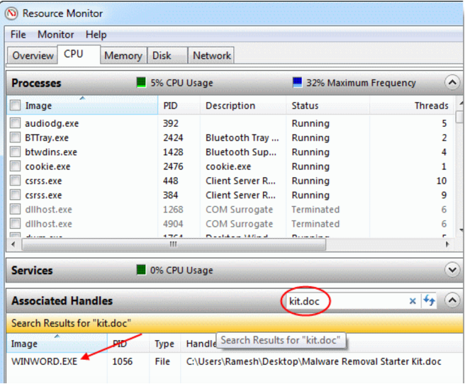

Ошибка синхронизации времени в Windows
Get-ScheduledTask SynchronizeTime
w32tm /query /peers
nslookup time.windows.com
tcping time.windows.com 123
123/udp
w32tm /config /update
w32tm /resync
w32tm /query /status

сброс 
net stop w32time
w32tm /unregister
w32tm /register
net start w32time
****************
Какая программа слушает определенный порт в Windows?
netstat -aon | findstr ":80" | findstr "LISTENING"
tasklist /FI "PID eq 16124"

Get-Process -Id (Get-NetTCPConnection -LocalPort 80).OwningProcess
Get-Process -Id (Get-NetUDPEndpoint -LocalPort 80).OwningProcess
****************
Как полностью удалить драйвер в Windows
dism /online /get-drivers /format:table
pnputil /delete-driver <Published Name> /uninstall /force
****************
Как расширить диск (раздел) в Windows
Get-Partition -DiskNumber 0
Get-PartitionSupportedSize -DriveLetter C
Resize-Partition -DriveLetter C -Size 42169532416
Изменить имя компьютера в Windows
•	Длина не более 15 символов
•	Не должно содержать специальных символов (< > ; : » * + = \ | ? ,)
•	Можно использовать тире и нижнее подчеркивание
•	Не должно состоять только из цифр
•	Имя компьютера регистр независимо
•	Если компьютер будет добавлен в домен Active Directory, имя компьютера должно быть уникальным в пределах домена.
Rename-Computer -NewName "WKS-MSKO12S3" –Restart -Force
логи печати принтеров из журнала событий Windows
$all2dayprint=Get-WinEvent -FilterHashTable @{LogName="Microsoft-Windows-PrintService/Operational"; ID=307; StartTime=(Get-Date).AddDays(-1)} | Select-object -Property TimeCreated, @{label='UserName';expression={$_.properties[2].value}}, @{label='Document';expression={$_.properties[1].value}}, @{label='PrinterName';expression={$_.properties[4].value}}, @{label='PrintSizeKb';expression={$_.properties[6].value/1024}}, @{label='Pages';expression={$_.properties[7].value}}
$all2dayprint|ft
****************
Просмотр и анализ событий (логов) Windows с помощью PowerShell
Get-WinEvent -FilterHashtable @{logname='System';id=1074}|ft TimeCreated,Id,Message
В параметре FilterHashtable можно использовать фильтры по следующим атрибутам событий:
•	LogName
•	ProviderName
•	Path
•	Keywords (для поиска успешных событий нужно использовать значение 9007199254740992 или для неуспешных попыток 4503599627370496)
•	ID
•	Level (1=FATAL, 2=ERROR, 3=Warning, 4=Information, 5=DEBUG, 6=TRACE, 0=Info)
•	StartTime
•	EndTime
•	UserID (SID пользователя)
•	Data
****************
Как вручную установить размер MTU
HKEY_LOCAL_MACHINE\SYSTEM\CurrentControlSet\Services\Tcpip\Parameters\Interfaces\<AdapterID>
****************
Меняем значение Time To Live (TTL)
HKEY_LOCAL_MACHINE\SYSTEM\CurrentControlSet\Services\Tcpip\Parameters
New — DWORD (32-bit), задайте имя этому параметру имя «DefaultTTL» и установите его значение в диапазоне от «0» до «255»
****************
Resource Monitor для определения блокировок файлов
 
 ****************
Сброс настроек протокола TCP/IP
ipconfig /flushdns
nbtstat -R
nbtstat -RR
netsh int reset all
netsh int ip reset
netsh winsock reset
netsh interface tcp set global autotuninglevel=disabled
****************
Изоляция драйвера принтера
Как следует из названия, технология Printer Driver Isolation (PDI) реализует изоляцию драйверов принтеров в отдельные процессы, отделенные от процесса диспетчера печати (spoolsv.exe)
************
Восстановление хранилища компонентов
Файлы хранилища компонентов Windows на диске располагаются в каталоге \Windows\WinSxS
Файлы в каталогах:
•	%SYSTEMROOT%\Servicing\Packages
•	%SYSTEMROOT%\WinSxS\Manifests
Содержимое веток реестра:
•	%SYSTEMROOT%\WinSxS\Manifests
•	HKEY_LOCAL_MACHINE\Schema
•	HKEY_LOCAL_MACHINE\Components
•	HKEY_LOCAL_MACHINE\Software\Microsoft\Windows\CurrentVersion\Component Based Servicing
Code	Error	Description
0×80070002	ERROR_FILE_NOT_FOUND	The system cannot find the file specified.
0x8007000D	ERROR_INVALID_DATA	The data is invalid.
0x800F081F	CBS_E_SOURCE_MISSING	The source for the package or file not found.
0×80073712	ERROR_SXS_COMPONENT_STORE_CORRUPT	The component store is in an inconsistent state.
0x800736CC	ERROR_SXS_FILE_HASH_MISMATCH	A component’s file does not match the verification information present in the component manifest.
0x800705B9	ERROR_XML_PARSE_ERROR	Unable to parse the requested XML data.
0×80070246	ERROR_ILLEGAL_CHARACTER	An invalid character was encountered.
0x8007370D	ERROR_SXS_IDENTITY_PARSE_ERROR	An identity string is malformed.
0x8007370B	ERROR_SXS_INVALID_IDENTITY_ATTRIBUTE_NAME	The name of an attribute in an identity is not within the valid range.
0x8007370A	ERROR_SXS_INVALID_IDENTITY_ATTRIBUTE_VALUE	The value of an attribute in an identity is not within the valid range.
0×80070057	ERROR_INVALID_PARAMETER	The parameter is incorrect.
0x800B0100	TRUST_E_NOSIGNATURE	No signature was present in the subject.
0×80092003	CRYPT_E_FILE_ERROR	An error occurred while Windows Update reads or writes to a file.
0x800B0101	CERT_E_EXPIRED	A required certificate is not within its validity period when verifying against the current system clock or the time stamp in the signed file.
0x8007371B	ERROR_SXS_TRANSACTION_CLOSURE_INCOMPLETE	One or more required members of the transaction are not present.
0×80070490	ERROR_NOT_FOUND	Windows could not search for new updates.
Dism /Online /Cleanup-Image /CheckHealth
1.	Команда Dism /Cleanup-Image сохраняет логи в каталогах C:\Windows\Logs\CBS\CBS.log и C:\Windows\Logs\DISM\dism.log
2.	Dism.exe /Online /Cleanup-Image /Restorehealth
3.	Get-WindowsImage -ImagePath E:\sources\install.wim
4.	Repair-WindowsImage -Online -RestoreHealth -Source G:\sources\install.wim:1
 проверка целостности системных файлов с помощью команды
sfc /scannow
net stop wuauserv

net stop bits

net stop cryptsvc

ren %systemroot%\SoftwareDistribution oldSD

ren %systemroot%\System32\catroot2 oldCat2

net start cryptsvc

net start bits

net start wuauserv
*************
Настройка часового пояса в Windows
reg query HKLM\SYSTEM\CurrentControlSet\Control\TimeZoneInformation
Get-TimeZone -ListAvailable | Where-Object {$_.Id -like "*Russ*"}
Set-TimeZone -Name "Astrakhan Standard Time"
************
Резервное копирование (экспорт) и восстановление драйверов в Windows
Export-WindowsDriver –Online -Destination c:\drivers
pnputil.exe /add-driver C:\drivers\*.inf /subdirs /install
***********
WMI: Исправление ошибок, восстановление репозитория в Windows
%windir%\System32\Wbem\Repository 
•	Ошибки обработки WMI запросов в системных журналах и логах приложений ( 0x80041002 - WBEM_E_NOT_FOUND , WMI: Not Found , 0x80041010 WBEM_E_INVALID_CLASS );
•	Ошибки обработки GPO, связанные на WMI ( некорректная работа wmi фильтров групповых политик, и пр.);
•	WMI запросы выполняются очень медленно;
•	Ошибки при установке или работе агентов SCCM/SCOM;
•	Ошибки в работе скриптов (vbs или PowerShell), использующих пространство имен WMI (скрипты с Get-WmiObject и т.д.).
проверить целостность репозитория WMI с помощью команды:
winmgmt /verifyrepository
Winmgmt /salvagerepository
Мяг
sc config winmgmt start= disabled
net stop winmgmt
cd %windir%\system32\wbem
for /f %s in ('dir /b *.dll') do regsvr32 /s %s
wmiprvse /regserver
sc config winmgmt start= auto
net start winmgmt
for /f %s in ('dir /b *.mof') do mofcomp %s
for /f %s in ('dir /b *.mfl') do mofcomp %s
cd %windir%\SysWOW64\wbem
жестк
Winmgmt /resetrepository

sc config winmgmt start= disabled
net stop winmgmt
cd %windir%\system32\wbem
winmgmt /resetrepository
winmgmt /resyncperf
if exist Repos_bakup rd Repos_bakup /s /q
rename Repository Repos_bakup
regsvr32 /s %systemroot%\system32\scecli.dll
regsvr32 /s %systemroot%\system32\userenv.dll
for /f %s in ('dir /b *.dll') do regsvr32 /s %s
for /f %s in ('dir /b *.mof') do mofcomp %s
for /f %s in ('dir /b *.mfl') do mofcomp %s
sc config winmgmt start= auto
net start winmgmt
wmiprvse /regserver
************
Сброс настроек службы обновлений Windows Update
net stop bits
net stop wuauserv
net stop appidsvc
net stop cryptsvc
taskkill /im wuauclt.exe /f
Del "%ALLUSERSPROFILE%\Application Data\Microsoft\Network\Downloader\qmgr*.dat"
Ren %systemroot%\SoftwareDistribution SoftwareDistribution.bak
Ren %systemroot%\system32\catroot2 catroot2.bak
del /f /s /q %windir%\windowsupdate.log
sc.exe sdset bits D:(A;;CCLCSWRPWPDTLOCRRC;;;SY) (A;;CCDCLCSWRPWPDTLOCRSDRCWDWO;;;BA) (A;;CCLCSWLOCRRC;;;AU) (A;;CCLCSWRPWPDTLOCRRC;;;PU)
sc.exe sdset wuauserv D:(A;;CCLCSWRPWPDTLOCRRC;;;SY) (A;;CCDCLCSWRPWPDTLOCRSDRCWDWO;;;BA) (A;;CCLCSWLOCRRC;;;AU) (A;;CCLCSWRPWPDTLOCRRC;;;PU)
sc.exe sdset cryptsvc D:(A;;CCLCSWLOCRRC;;;AU)(A;;CCDCLCSWRPWPDTLOCRSDRCWDWO;;;BA)(A;;CCDCLCSWRPWPDTLCRSDRCWDWO;;;SO)(A;;CCLCSWRPWPDTLOCRRC;;;SY)S:(AU;FA;CCDCLCSWRPWPDTLOCRSDRCWDWO;;WD)
sc.exe sdset trustedinstaller D:(A;;CCLCSWLOCRRC;;;AU)(A;;CCDCLCSWRPWPDTLOCRSDRCWDWO;;;BA)(A;;CCDCLCSWRPWPDTLCRSDRCWDWO;;;SO)(A;;CCLCSWRPWPDTLOCRRC;;;SY)S:(AU;FA;CCDCLCSWRPWPDTLOCRSDRCWDWO;;WD)
cd /d %windir%\system32
regsvr32.exe /s atl.dll
regsvr32.exe /s urlmon.dll
regsvr32.exe /s mshtml.dll
regsvr32.exe /s shdocvw.dll
regsvr32.exe /s browseui.dll
regsvr32.exe /s jscript.dll
regsvr32.exe /s vbscript.dll
regsvr32.exe /s scrrun.dll
regsvr32.exe /s msxml.dll
regsvr32.exe /s msxml3.dll
regsvr32.exe /s msxml6.dll
regsvr32.exe /s actxprxy.dll
regsvr32.exe /s softpub.dll
regsvr32.exe /s wintrust.dll
regsvr32.exe /s dssenh.dll
regsvr32.exe /s rsaenh.dll
regsvr32.exe /s gpkcsp.dll
regsvr32.exe /s sccbase.dll
regsvr32.exe /s slbcsp.dll
regsvr32.exe /s cryptdlg.dll
regsvr32.exe /s oleaut32.dll
regsvr32.exe /s ole32.dll
regsvr32.exe /s shell32.dll
regsvr32.exe /s initpki.dll
regsvr32.exe /s wuapi.dll
regsvr32.exe /s wuaueng.dll
regsvr32.exe /s wuaueng1.dll
regsvr32.exe /s wucltui.dll
regsvr32.exe /s wups.dll
regsvr32.exe /s wups2.dll
regsvr32.exe /s wuweb.dll
regsvr32.exe /s qmgr.dll
regsvr32.exe /s qmgrprxy.dll
regsvr32.exe /s wucltux.dll
regsvr32.exe /s muweb.dll
regsvr32.exe /s wuwebv.dll
netsh winsock reset
netsh winhttp reset proxy
REG DELETE "HKLM\SOFTWARE\Microsoft\Windows\CurrentVersion\WindowsUpdate" /v AccountDomainSid /f
REG DELETE "HKLM\SOFTWARE\Microsoft\Windows\CurrentVersion\WindowsUpdate" /v PingID /f
REG DELETE "HKLM\SOFTWARE\Microsoft\Windows\CurrentVersion\WindowsUpdate" /v SusClientId /f
REG DELETE "HKLM\SOFTWARE\Policies\Microsoft\Windows\WindowsUpdate" /v TargetGroup /f
REG DELETE "HKLM\SOFTWARE\Policies\Microsoft\Windows\WindowsUpdate" /v WUServer /f
REG DELETE "HKLM\SOFTWARE\Policies\Microsoft\Windows\WindowsUpdate" /v WUStatusServer /f
sc.exe config wuauserv start= auto
sc.exe config bits start= delayed-auto
sc.exe config cryptsvc start= auto
sc.exe config TrustedInstaller start= demand
sc.exe config DcomLaunch start= auto
net start bits
net start wuauserv
net start appidsvc
net start cryptsvc
wuauclt /resetauthorization /detectnow
*********
Управление приоритетами процессов в Windows
Где это может понадобиться? Например, в связке 1С-SQL можно дать больше процессорного времени 1С и SQL, как наиболее критичным к ресурсам процессам
Они группируются так:
•	31 — 16 уровни реального времени;
•	15 — 1 динамические уровни;
•	0 — системный уровень, зарезервированный для потока обнуления страниц (zero-page thread).
При создании процесса, ему назначается один из шести классов приоритетов:
1.	Real time class (значение 24),
2.	High class (значение 13),
3.	Above normal class (значение 10),
4.	Normal class (значение 8),
5.	Below normal class (значение 6),
6.	или Idle class (значение 4).
Приоритет каждого потока (базовый приоритет потока) складывается из приоритета его процесса и относительного приоритета самого потока. Есть семь относительных приоритетов потоков:
1.	Normal: такой же как и у процесса;
2.	Above normal: +1 к приоритету процесса;
3.	Below normal: -1;
4.	Highest: +2;
5.	Lowest: -2;
6.	Time critical: устанавливает базовый приоритет потока для Real time класса в 31, для остальных классов в 15.
7.	Idle: устанавливает базовый приоритет потока для Real time класса в 16, для остальных классов в 1.
wmic process where processid='XXXX' CALL setpriority ProcessIDLevel
wmic process where processid='8476' CALL setpriority "above normal"
**************
Измерение производительности и IOPS жестких дисков
Physical Disk (можете выбрать счётчики для конкретного диска или для всех доступных локальных дисков):
•	 Disk sec/Transfer – время, необходимое для выполнения одной операции записи/чтения на устройство хранения/диск — disk latency. Если задержка более 25 мс (0.25) или выше, значит дисковый массив не успевает выполнять операции. Для высоконагруженных систем значение не должно превышать 10 мс (0.1);
•	Disk Transfers/sec – количество операций чтения/записи в секунду (IOPS). Это основной показатель интенсивности обращений к дискам (примерные значения в IOPS для разных типов дисков представлены в конце статьи);
•	Disk Bytes/Sec – средняя скорость обмена с диском (чтения/записи) за 1 секунду. Максимальные значения зависит от типа диска (150-250 Мб/секунду — для обычного диска и 500-10000 для SSD);
•	Split IO/sec – показатель фрагментации диска, когда операционной системе приходится разделять одну операцию ввода/вывода на несколько операций. Может также говорить о том, приложение запрашивает слишком большие блоки данных, которые немогут быть переданы за одну операцию;
•	Avg. Disk Queue Length– длина очереди к диску (количество транзакций ожидающий обработку). Для одиночного диска длина очереди не должна превышать 2. Для RAID массива из 4 дисков длина очереди до 8 будет считаться допустимым значением
https://aka.ms/diskspd
diskspd.exe –c50G -d300 -r -w40 -t8 -o32 -b64K -Sh -L E:\diskpsdtmp.dat > DiskSpeedResults.txt
•	 -c50G – размер файла 50 Гб (лучше использовать большой размер файла, чтобы он не поместился в кэш контроллера СХД);
•	 -d30 0 – продолжительность тестирования в секундах;
•	 -r – произвольное чтение/запись (если нужно тестировать последовательный доступ, используйте –s);
•	 -t8 – количество потоков;
•	 -w40 – соотношение операций записи к операциям чтения 40% / 60%;
•	 -o32 — длина очереди;
•	 -b64K — размер блока;
•	 -Sh — не использовать кэширование;
•	 -L — измерять задержки (latency) ;
•	 E:\diskpsdtmp.dat – путь к тестовому файл.
•	В следующей таблице указаны примерные значения IOPS для различных типов дисков:
Тип	IOPS
SSD(SLC)	6000
SSD(MLC)	1000
15K RPM	175-200
10K RPM	125-150
7.2K RPM	50-75
RAID5 из 6 дисков с 10000 RPM	900
User Account Control
•	Уровень 4 — Always notify — Всегда уведомлять (максимальный уровень защиты UAC);
•	Уровень 3 — Notify only when programs try to make changes to my computer (default) – Уведомить только когда программа пытается внести изменения в мой компьютер (стандартный уровень защиты);
•	Уровень 2 — Notify only when programs try to make changes to my computer (do not dim my desktop) – то же что и предыдущий уровень, но без переключения на Secure Desktop с блокировкой рабочего стола;
•	Уровень 1 — Never notify – Никогда не уведомлять (UAC отключен).
New-ItemProperty -Path HKLM:Software\Microsoft\Windows\CurrentVersion\policies\system -Name EnableLUA -PropertyType DWord -Value 0 -Force
Имя политики		Ключ реестра, настраиваемый политикой
User Account Control: Admin Approval Mode for the Built-in Administrator account	Контроль учетных записей: использование режима одобрения администратором для встроенной учетной записи администратора	FilterAdministratorToken
User Account Control: Allow UIAccess applications to prompt for elevation without using the secure desktop	Контроль учетных записей: разрешать UIAccess-приложениям запрашивать повышение прав, не используя безопасный рабочий стол	EnableUIADesktopToggle
User Account Control: Behavior of the elevation prompt for administrators in Admin Approval Mode	Контроль учетных записей: поведение запроса на повышение прав для администраторов в режиме одобрения администратором	ConsentPromptBehaviorAdmin
User Account Control: Behavior of the elevation prompt for standard users	Контроль учетных записей: поведение запроса на повышение прав для обычных пользователей	ConsentPromptBehaviorUser
User Account Control: Detect application installations and prompt for elevation	Контроль учетных записей: обнаружение установки приложений и запрос на повышение прав	EnableInstallerDetection
User Account Control: Only elevate executables that are signed and validated	Контроль учетных записей: повышение прав только для подписанных и проверенных исполняемых файлов	ValidateAdminCodeSignatures
User Account Control: Only elevate UIAccess applications that are installed in secure locations	Контроль учетных записей: повышать права только для UIAccess-приложений, установленных в безопасном местоположении	EnableSecureUIAPaths
User Account Control: Run all administrators in Admin Approval Mode	Контроль учетных записей: включение режима одобрения администратором	EnableLUA
User Account Control: Switch to the secure desktop when prompting for elevation	Контроль учетных записей: переключение к безопасному рабочему столу при выполнении запроса на повышение прав	PromptOnSecureDesktop
User Account Control: Virtualize file and registry write failures to per-user locations	Контроль учетных записей: при сбоях записи в файл или реестр виртуализация в размещение пользователя	EnableVirtualization
Восстановление несохраненного документа в Word
 
C:\Users\%username%\AppData\Local\Microsoft\Office\UnsavedFiles
C:\Users\%username%\AppData\Roaming\Microsoft\Word
*********
Принудительная очистка очереди печати в Windows
при отправке документа на печать на принтер, служба печати Windows (Print Spooler) формирует задание печати и создает два файла: один с расширением .SHD (содержит настройки задания печати), второй — .SPL (хранит собственно данные, которые нужно распечатать). Таким образом, задания печати будут доступны службе печати, даже после закрытия программы, инициировавшей печать. Данные файлы хранятся в каталоге спулера (по умолчанию, «%systemroot%\System32\spool\PRINTERS”)
net stop spooler
del %systemroot%\system32\spool\printers\*.shd /F /S /Q
del %systemroot%\system32\spool\printers\*.spl /F /S /Q
net start spooler
*********
Очистка (сброс) поврежденного кэша иконок в Windows
iconcache_ (iconcache_16.db, iconcache_32.db, iconcache_48.db и т.д. в соответствии с размерами иконки в пикселях) и хранятся в каталоге %userprofile%\AppData\Local\Microsoft\Windows\Explorer
taskkill /f /im explorer.exe
cd /d %userprofile%\AppData\Local\Microsoft\Windows\Explorer
attrib –h iconcache_*.db
del /f IconCache*
del /f thumbcache*
cd /d  %userprofile%\AppData\Local\
attrib –h IconCache.db
del /f IconCache.db
start C:\Windows\explorer.exe
*************
Как в Windows 10 отключить ограничение на длину пути в 260
Set-ItemProperty -Path HKLM:\SYSTEM\CurrentControlSet\Control\FileSystem -Name LongPathsEnabled -Value 1
Настройка макета меню Пуск и панели задач в Windows 10
Export-StartLayout –path c:\ps\StartLayoutW10.xml
Import-StartLayout –LayoutPath c:\ps\StartLayoutW10.xml  –MountPath c:\
Ошибка 0x00000057 при установке сетевого принтера
ам понадобится компьютер, на котором данный принтер установлен корректно и успешно печатает. На этом компьютере запустите редактор реестра и перейдите в следующую ветку реестра
•	на x64 системе: HKEY_LOCAL_MACHINE System\CurrentControlSet\Control\Print\Environments\Windows NT x64\Drivers\Version-3\
•	на x86 системе HKEY_LOCAL_MACHINE\System\CurrentControlSet\Control\Print\Environments\Windows NT x86\Drivers\Version-3\
•	Найдите ветку с именем драйвера принтера, который вы хотите установить и экспортируйте ее в Reg файл.
•	Затем в данной ветке найдите значение ключа InfPath. В моем примере это C:\Windows\System32\DriverStore\FileRepository\prnhp002.inf_amd64_neutral_04d05d1f6a90ea24\prnhp002.inf
Перейдите в каталог C:\Windows\System32\DriverStore\FileRepository и найдите имя папки, на которую указывает ключ
Теперь на проблемном компьютере попытайтесь найти эту папку. Скорее всего она будет присутствовать, но будет пустой. Это свидетельствует о том, что процесс установки драйвера аварийно прервался
*******
Отключение протоколов NetBIOS и LLMNR в Windows
LLMNR (UDP/5355, Link-Local Multicast Name Resolution — механизм широковещательного разрешения имен) – протокол присутствует во всех версиях Windows, начиная с Vista и позволяет IPv6 и IPv4 клиентам разрешать имена соседних компьютеров без использования DNS сервера за счет широковещательных запросов в локальном сегменте сети L2. Этот протокол также автоматически используется при недоступности DNS (в рабочих группах Windows этот протокол используется для сетевого обнаружения/Network Discovery). Соответственно, при работающих DNS-серверах в домене, этот протокол абсолютно не нужен
ротокол NetBIOS over TCP/IP или NBT-NS (UDP/137,138;TCP/139) – является широковещательным протоколом-предшественником LLMNR и используется в локальной сети для публикации и поиска ресурсов. Поддержка NetBIOS over TCP/IP по умолчанию включена для всех интерфейсов во всех версиях Windows
New-Item  "HKLM:\SOFTWARE\Policies\Microsoft\Windows NT" -Name DNSClient  -Force
New-ItemProperty "HKLM:\SOFTWARE\Policies\Microsoft\Windows NT\DNSClient" -Name EnableMultiCast -Value 0 -PropertyType DWORD  -Force

$regkey = "HKLM:SYSTEM\CurrentControlSet\services\NetBT\Parameters\Interfaces"
Get-ChildItem $regkey |foreach { Set-ItemProperty -Path "$regkey\$($_.pschildname)" -Name NetbiosOptions -Value 2 -Verbose}
Не удается подключить сетевой принтер в Windows
Ошибка 0x00000002 может возникнуть при попытке подключить сетевой принтер через принт-сервер и TCP/IP порт
Remove-PrinterDriver -Name "HP Universal Printing PCL 6"
Массовая проблема с подключением сетевых принтеров Windows с ошибкой 0x0000011b началась после установки обновлений безопасности Windows с 15 сентября 2021 года.
reg add "HKEY_LOCAL_MACHINE\Software\Policies\Microsoft\Windows NT\Printers\PointAndPrint" /v RestrictDriverInstallationToAdministrators /t REG_DWORD /d 0 /f
*********
Windows LAPS
Windows при загрузке изменит пароль локального администратора и запишет его в защищенный атрибут msLAPS-Password в объект компьютера в AD
•	msLAPS-PasswordExpirationTime
•	msLAPS-Password
•	msLAPS-EncryptedPassword
•	msLAPS-EncryptedPasswordHistory
•	msLAPS-EncryptedDSRMPassword
•	msLAPS-EncryptedDSRMPasswordHistory
Get-Command -Module LAPS
Ошибка Windows: обновление неприменимо к вашему компьютеру
•	Если компьютер давно не перезагружался или не перезагружался после установки последних обновлений, попробуйте принудительно перезагрузить Windows;
•	Данное обновление не соответствует вашей версии ОС, редакции, билду, разрядности (архитектуре процессора: x86, x64; ARM) или языку
Перед установкой некоторых обновлений нужно сначала установить последнее доступное обновление служебного стека (SSU — Servicing Stack Update)
проверьте ошибки установки обновлений в файле %systemroot%\Logs\CBS\CBS.log
expand _f:* “C:\Temp\windows10.0-KB4103723-x64.msu” C:\Temp\KB4103723
DISM.exe /Online /Add-Package /PackagePath:c:\Temp\Windows10.0-KB4103723-x64.cab
